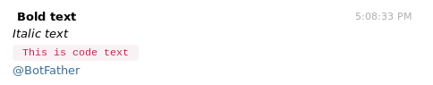

# telegram-go

## Example on how to use Telegram with Go language

### To run example:

```go
package main

import (
	"github.com/evzpav/telegram-go/telegram"
	"github.com/joho/godotenv"
	"log"
	"os"
)

var telegramBotToken string
var telegramGroupID string

func init() {
	err := godotenv.Load()
	if err != nil {
		log.Fatal("Error loading .env file")
	}
	telegramBotToken = os.Getenv("TELEGRAM_BOT_TOKEN")
	telegramGroupID = os.Getenv("TELEGRAM_GROUP_ID")
}

func main() {

	message := "<b> Bold text </b>"
	message += "\n" // new line
	message += "<i>Italic text</i> \n"
	message += "<code> This is code text </code> \n"
	message += "@BotFather \n" //use existing Telegram username

	t := telegram.NewTelegramClient(telegramBotToken, telegramGroupID)
	t.SendMessage(message)
}
```

```bash
cp .env_example .env
# Fill bot token and group ID or channel ID

go build

./telegram-go

```
### Expected result:



## Steps to get Telegram credentials
1) Search 'BotFather' on Telegram
2) Follow instructions to create a bot
3) Get the token and use it on .env TELEGRAM_BOT_TOKEN variable
4) Create group or channel on the mobile version. (Same bot can be used for many groups or channels)
5) Group ID: Go to desktop version, click on the group and check url: https://web.telegram.org/#/im?p=g[GROUPID]. After the 'g' is the group id. Add a '-' in the front on the group ID. Example: https://web.telegram.org/#/im?p=g123456789 => Channel ID (TELEGRAM_GROUP_ID) = -123456789
6) Channel ID: Go to desktop version, click on the channel and check url. Channel ID will be like https://web.telegram.org/#/im?p=c[CHANNELID]_8223454421537982907. Add a '-100' in the front on the channel ID. Example: https://web.telegram.org/#/im?p=c1234567890_8565613421537982907 => Group ID (TELEGRAM_GROUP_ID) = -1001234567890
7) On the mobile version, go to the group or channel and add the bot created as administrator of the group.